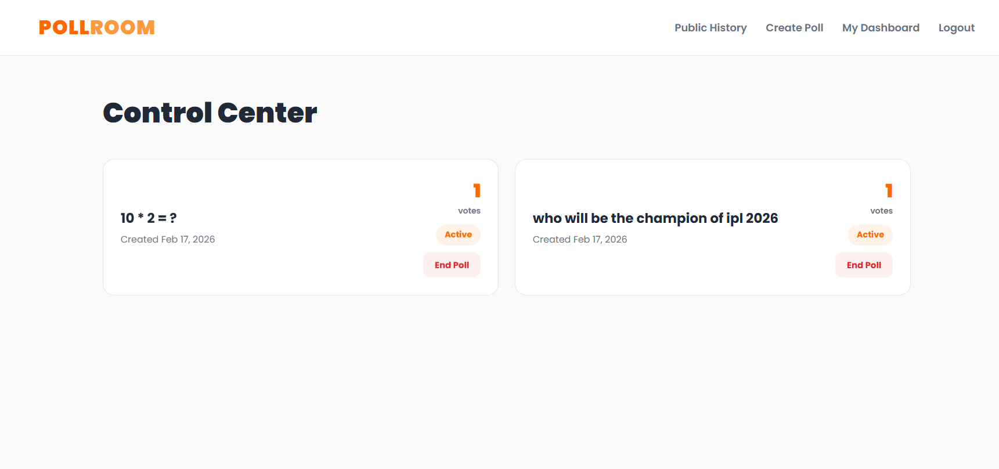
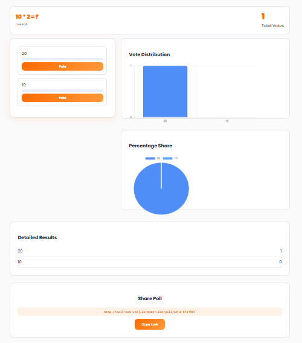
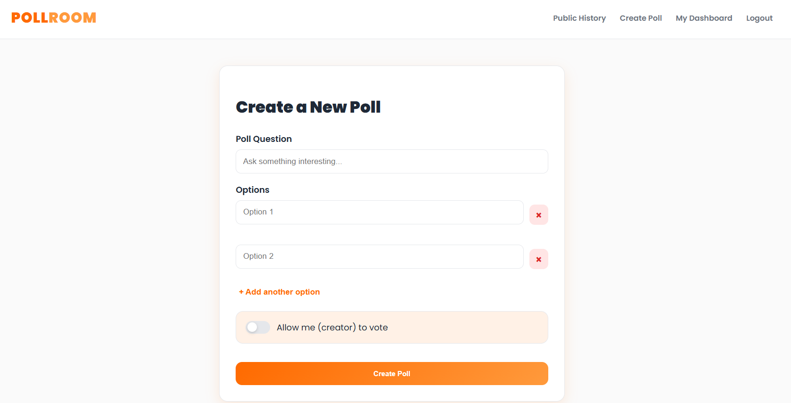

# 🗳️ PollRoom - Real-Time Voting System

PollRoom is a powerful, real-time polling application built with **Django** and **Django Channels**. It allows users to create polls, share them with others, and see live results update instantly without refreshing the page.

---

<h1 align="center">📸 Screenshots</h1>

<p align="center">🎈 Seamless Integration</p>
<p align="center">  </p>
<p align="center"> Manage all your polls from a centralized <b>Dashboard</b>. You can track which polls are active, which are closed, and create new ones instantly. </p>

---

<p align="center">📺 Instant Results</p>
<p align="center">  </p>
<p align="center"> The <b>Poll Detail Page</b> features a real-time progress bar. As users vote, the percentages and counts update live using WebSocket technology via Django Channels. </p>

---

<p align="center">⚙️ Control Center</p>
<p align="center">  </p>
<p align="center"> Use the <b>Create Poll</b> menu to add questions and multiple options. You can also toggle settings like "Include Creator" to determine if you are allowed to vote on your own poll. </p>

---

<p align="center">🏆 Historical Data</p>
<p align="center">  </p>
<p align="center"> <b>Never lose track!</b> The History section allows everyone to view past polls and their final outcomes, ensuring transparency in every vote. </p>

---

## 🚀 Deployed on Render

This project is configured for deployment on **Render**.

> [!IMPORTANT]
> **Cold Start Notice:** Since the website is hosted on a free tier, the server may "spin down" after a period of inactivity. When you open the website for the first time, **it may take about 1 minute to load**. Please be patient; once it wakes up, it will be fast and responsive!

---

## 🎯 Key Features

* **Real-Time Updates**: Powered by **Django Channels (ASGI)** and **Daphne** for live WebSocket communication.
* **Anti-Cheat Voting**: Prevents double-voting by tracking both authenticated users and the user's IP address. This ensures that opening a new **Incognito window** will not allow a user to vote twice.
* **Creator Controls**: Creators can stop polls at any time and choose whether they are allowed to participate.
* **Responsive UI**: Works perfectly on both desktop and mobile devices.
* **Static Hosting**: Uses **WhiteNoise** for efficient delivery of CSS and JavaScript files in production.

---

## 🧩 Local Installation Steps

If you want to run this project locally, follow these steps:

1. **Clone the repository**
2. **Install Dependencies**:
```bash
pip install -r requirements.txt

```


3. **Run Migrations**:
```bash
python manage.py migrate

```


4. **Collect Static Files**:
```bash
python manage.py collectstatic --noinput

```


5. **Start the Development Server**:
```bash
daphne -b 0.0.0.0 -p 8000 pollroom.asgi:application

```


---

## 🛠 Tech Stack

* **Backend**: Django 5.0.7
* **Real-Time**: Django Channels & Daphne
* **Database**: SQLite3
* **Frontend**: Django Templates & CSS
* **Production Server**: WhiteNoise (Static files)

---

## 🔒 Privacy & Security

* **Password Validation**: Standard Django security for user accounts.
* **CSRF Protection**: Configured for secure cross-site request handling on Render.
* **Voting Integrity**: Logic implemented to block creator voting and multiple votes from the same IP address.

---

## 🛠 Support

If you encounter the error **"Already voted from this network"**, it means a vote has already been recorded from your IP address. This security measure ensures one vote per person regardless of browser mode.

Enjoy creating polls with **PollRoom**! 🎯
